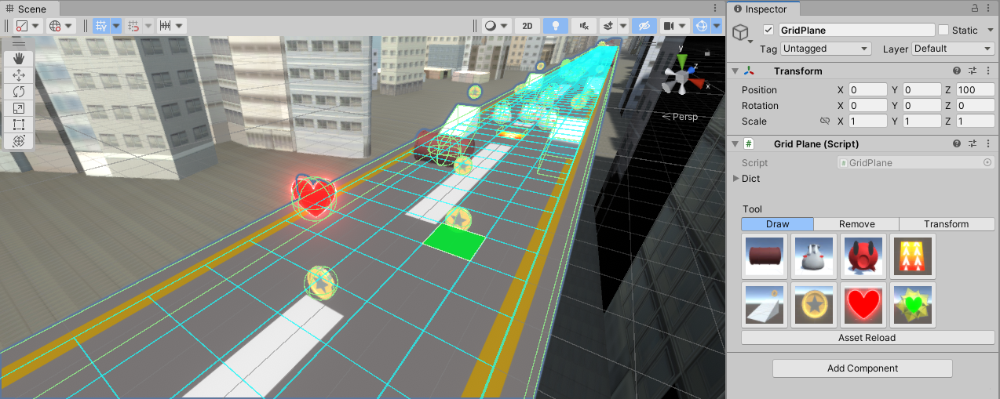
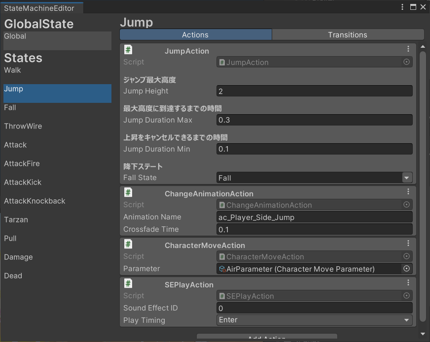
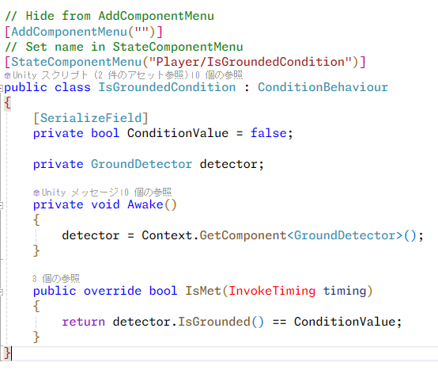
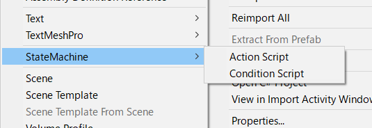
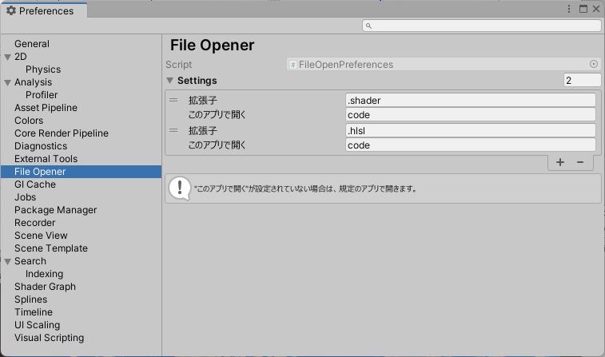
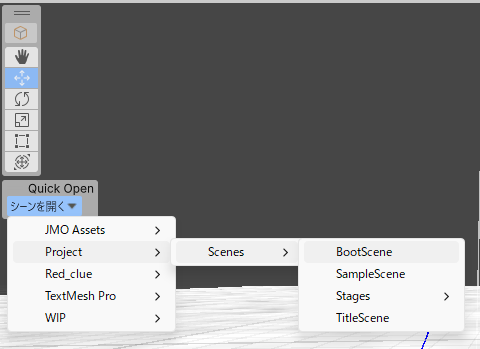

# はじめに
閲覧頂きありがとうございます。  
このページでは、これまで制作した作品の一部を紹介しています。  
作品のプロジェクトファイル、ビルドファイルは別途添付しているGoogleDriveをご覧ください。

## 自己紹介
**中村 大智(なかむら だいち)**  
名古屋工学院専門学校 ゲーム総合学科  
卒業予定 2025年3月  

C#と設計を中心に勉強しています。グラフィックスAPIとゲームエンジンに興味があります。  
ツール制作が好きです。  

## 使用できる言語/ツール  
一番自信のあるC#を基準に考えています。

| 言語/ツール  | 習熟度 | 備考                                              |
|-----------|--------|-------------------------------------------------|
| C#        | ★★★★★★ | 言語機能の理解度には自信があります                        |
| Unity     | ★★★★★★ | 基本的な機能を十分に理解しています                        |
| C++       | ★★★★☆☆ | ヒープやポインタに対する理解があります                            |
| DirectX   | ★★★★☆☆ | DirectX12で描画フレームワークを開発しています               |
| HLSL/GLSL | ★★★☆☆☆ | アウトラインや水面のシェーダーを考えて実装したことがあります               |
| GitHub    | ★★★☆☆☆ | チームを主導してIssueやPRを活用する基盤を整え、コードレビューを行っています |

# 目次
- [2Dゲーム](#2d)
    - [クックストライク](#クックストライク)
    - [スライムラッシュ](#スライムラッシュ)
    - [パピルスのだいぼうけん](#パピルスのだいぼうけん)
- [3Dゲーム](#3d)
    - [Impact!](#impact)
    - [アマツバメ](#アマツバメ)D
- [エディタ拡張/その他](#エディタ拡張その他)

# 2D
## クックストライク
<iframe width="560" height="315" src="https://www.youtube.com/embed/CG_xRZioAYI?si=-OQR1SQbavKKfZyj" title="YouTube video player" frameborder="0" allow="accelerometer; autoplay; clipboard-write; encrypted-media; gyroscope; picture-in-picture; web-share" allowfullscreen></iframe>  

23年8月頃に行われた「プロトスプリントリーグ」(ゲームジャム)で制作した作品です。  
全5チームの作品の中から優秀賞に選ばれました。  

チーム人数 5人  
制作期間 3日  
環境/ライブラリ Unity, UniTask, UniRx, DOTween

主な担当箇所  
設計, ゲーム進行制御, お客さん関連(移動、生成, 注文/レシピUI), スコア, 評判(星)  

[unityroom](https://unityroom.com/games/cook-strike)で遊ぶことができます。  

## パピルスのだいぼうけん
<iframe width="560" height="315" src="https://www.youtube.com/embed/Axn6NJHxkwI?si=4YG3XoPowgJ5g_7t" title="YouTube video player" frameborder="0" allow="accelerometer; autoplay; clipboard-write; encrypted-media; gyroscope; picture-in-picture; web-share" allowfullscreen></iframe>  

ゴムを使ったワイヤーアクションです。ゴムを引っ張ってゴムパッチン！したり、ゴムの反動で勢いよくキックしたりして、敵を倒しながら進んでいきます。

チーム人数 6人  
制作期間 3か月  
環境/ライブラリ Unity, UniTask, UniRx, DOTween, CRI Ware, SpriteStudio

主な担当箇所  
設計, ゲーム進行制御, プレイヤー制御, 収集アイテム, [エディター](#ステートマシン)  

## スライムラッシュ
<iframe width="560" height="315" src="https://www.youtube.com/embed/0nTE3o13VbQ?si=dIgHULWg1kaEJ1P0" title="YouTube video player" frameborder="0" allow="accelerometer; autoplay; clipboard-write; encrypted-media; gyroscope; picture-in-picture; web-share" allowfullscreen></iframe>  

日本ゲーム大賞2022アマチュア部門に向けて制作した作品です。

チーム人数 5人  
制作期間 2か月  
環境/ライブラリ Unity, UniTask, UniRx, DOTween

主な担当箇所  
設計, ゲーム進行制御, ダンジョン生成, カメラ制御, アイテム,  サウンド, ダメージ, ゲーム中UI全般, 武器選択画面

# 3D
## Impact!
<iframe width="560" height="315" src="https://www.youtube.com/embed/5e127fNT6hk?si=pbRNUQkbs_f3l5Dt" title="YouTube video player" frameborder="0" allow="accelerometer; autoplay; clipboard-write; encrypted-media; gyroscope; picture-in-picture; web-share" allowfullscreen></iframe>  

全国専門学校ゲームコンペティションに向けて制作した作品です。
ファイナリストに選ばれました。

個人制作  
制作期間 2週間  
環境/ライブラリ Unity, UniRx, DOTween

## アマツバメ
<iframe width="560" height="315" src="https://www.youtube.com/embed/cyGH6isQOco?si=ej6P3KKHTXOzrlKr" title="YouTube video player" frameborder="0" allow="accelerometer; autoplay; clipboard-write; encrypted-media; gyroscope; picture-in-picture; web-share" allowfullscreen></iframe>  

チーム人数 6人  
制作中  
環境/ライブラリ Unity, UniTask, UniRx, PrimeTween, VContainer

主な担当箇所  
設計, ゲーム進行制御, レール制御, カメラ制御, [エディター](#コースエディタ)  

# エディタ拡張/その他
## ステージエディタ
  

シーンビューに表示されたグリッド上に、オブジェクトを設置できるエディタです。  
インスペクターからオブジェクトを選択して、ワンボタンで設置できます。

## ステートマシン  
  

**Action**と**Transition**を組み合わせて、ステートを構築することができるエディタです。Transitionは**Condition**の組み合わせで定義されます。  
特定のクラスを継承して実装すると、エディタ上で**Action**、または**Condition**として使用できるようになります。  

  

これらのクラスはコンテキストメニューからテンプレートを生成することができます。

  

## ファイルを開くアプリを指定する
 

エディター上でダブルクリックした際に、どのアプリで開くのかを設定するための拡張です。  
この画像の場合は".shader"と".hlsl"がVisual Studio Codeで開かれるように設定しています。  

## シーンを開く
  

シーンビュー上に常駐しているツールバーから、シーンを開くことができるショートカットです。  
ファイルやフォルダが増え、深くなった階層からでもすぐに目的のシーンを開くことができ、便利で気に入っています。